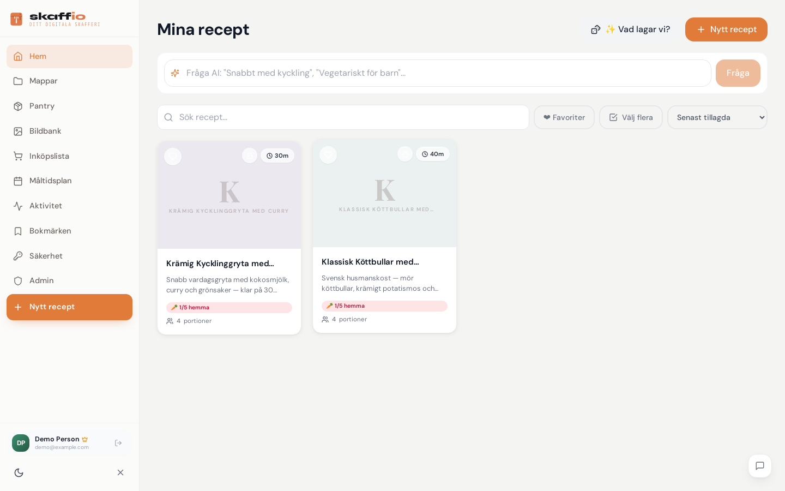
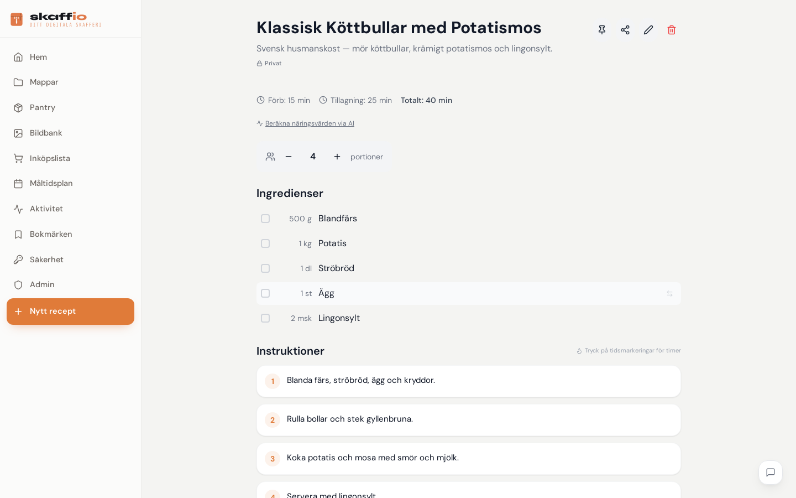
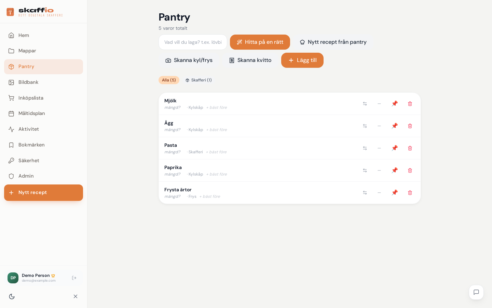

# Skaffio

> Hette tidigare **Fridgely** — det gamla namnet lever kvar på ett par ställen internt (containernamn, domän), men appen heter Skaffio.

Self-hosted **smart-kitchen PWA** för familjen — recept, måltidsplanering, skafferi, AI-assistens.

Byggd för Unraid + Docker Compose, men funkar var som helst med Docker.

---

## Skärmdumpar

| Recept | Receptdetalj | Pantry |
|---|---|---|
|  |  |  |

---

## Funktioner

### Recept
- Manuell input, **URL-import** (med AI-fallback för sajter utan JSON-LD), **PDF-import** (med vision-AI), **bildimport** (OCR via AI vision), **Instagram-import** (frame-extraktion ur video — inga play-knappar)
- Portionsskalning, taggar med färgkod
- **Rating** (5 stjärnor), **"Jag lagade detta"** med `times_cooked` + `last_cooked_at`
- **Cooking mode**: pinna recept, klickbara timers i instruktionerna, wake-lock så skärmen inte slocknar, `{{ingredient}}`-substitution
- **Recipe sharing** via publik länk + QR-kod (token-baserad, ingen auth krävs)
- Admin kan publicera valfritt recept (även importerade) för alla inbjudna hushåll
- **Sortering** på Hem (senaste / mest lagade / högst rating / längst sen vi lagade / A–Ö)
- **AI-receptsök**: skriv "snabbt med kyckling, max 30 min" → AI rankar dina egna recept
- **Slumpgenerator** "Vad lagar vi?" — viktas mot vad som finns i skafferiet
- Favoriter + Collections/mappar
- Export: **PDF per recept** + **JSON-dump** av hela samlingen
- AI auto-extracted näringsvärden (kalorier/protein/kolhydrater)

### Måltidsplan
- Vecka med drag-and-drop, fyra måltidstyper (frukost/lunch/middag/mellanmål)
- **AI-måltidsplanerare** — beskriv veckans önskemål på svenska → planen fylls i från din egen receptbas
- Inköpslista genereras automatiskt från planen

### Inköpslista
- Svensk kategoriindelning (Mejeri / Frukt&Grönt / Kött&Fisk / Skafferi / Fryst / Bröd)
- Realtidsdelning via publik token-länk (partner kan bocka av från jobbet)
- Auto-aggregering av samma ingrediens från flera recept
- **Drag & drop** — dra varor upp/ned i listan (draghandtag, funkar på touch); dras varan till en annan kategori byter den kategori

### Skafferi (Pantry)
- Manuell input + **AI vision-scan** av kylskåp/skafferi/frys
- Bäst-före-datum med visuella varningar (utgångna / går ut snart)
- Trafikljus på varje recept: 🥕 X/Y ingredienser hemma
- Frysportioner (barnportioner) — spara hela rätter som färdiga frysmål

### Familj / Multi-user
- JWT-auth, bcrypt-hash, audit-log per användare
- Admin-panel för användarhantering
- Första registreringen blir automatiskt admin

### PWA + UI
- Installerbar på mobil (Android/iOS) via "Lägg till på hemskärm"
- Auto-update av service worker — inga cache-trubbel efter deploy
- **Offline-läge** — recept, pantry & listor läsbara utan nät (NetworkFirst: färskt när nät finns, cache som fallback; bilder CacheFirst; cachen rensas vid utloggning)
- Dark mode med Tailwind, **Syne + DM Sans** som brand-typsnitt (design tokens i `tokens.css`)
- Skaffio-branding med logotyp + maskotar (Frasse, Skaffi, Bo & Konrad)

### Backup
- Automatisk daglig SQLite-snapshot till `/data/backups/`
- Unraid Appdata.Backup tar med hela `appdata/fridgely`
- (Rekommenderat) rclone-crypt till Google Drive för off-site

---

## Stack

- **Backend:** Python 3.12, FastAPI, SQLModel + SQLite, PyMuPDF (PDF), Pillow + yt-dlp + ffmpeg (image/video), PyJWT, slowapi
- **Frontend:** React 18, Vite, TailwindCSS v3, react-router-dom v6, vite-plugin-pwa, react-hot-toast, lucide-react, qrcode, date-fns
- **AI:** OpenAI-kompatibelt API (default Staik — kan bytas till Anthropic, OpenAI, Mistral, lokal vLLM/Ollama via `.env`)
- **Container:** Docker Compose — två services (`api` + `web`)
- **Reverse proxy / TLS:** Valfritt — t.ex. Cloudflare Tunnel med Access (SSO via Google)

---

## Snabbstart

```bash
git clone <repo-url> fridgely
cd fridgely
cp .env.example .env
# Editera .env — JWT_SECRET, AI_API_KEY, ev. Anthropic/HASS-grejer
docker compose up -d --build
```

Öppna **http://localhost:3111** (web) eller **http://localhost:8007/docs** (Swagger).

Första gången → registrera dig → du blir admin.

---

## Miljövariabler

Alla i `.env` (kopiera från `.env.example`):

| Variabel | Vad | Default |
|---|---|---|
| `JWT_SECRET` | Hemlig nyckel för JWT-tokens | (sätt själv) |
| `ALLOW_REGISTRATION` | `true` tills första kontot, sätt sen `false` | `true` |
| `AI_API_URL` | OpenAI-kompatibelt API-endpoint | `https://api.openai.com/v1` |
| `AI_API_KEY` | Nyckel för chat-modell | (krävs för AI-features) |
| `AI_MODEL` | Modell för text-prompts | `gpt-4o-mini` |
| `AI_VISION_MODEL` | Modell för bilder | samma som AI_MODEL |
| `ANTHROPIC_API_KEY` | Valfritt — för Claude-specifika tasks | (saknas = skip) |
| `HASS_URL` / `HASS_TOKEN` | Valfritt — Home Assistant-integration | (saknas = skip) |

---

## Data & Backup

All persistent data ligger i volymen som mountas in i `api`-containern (se `docker-compose.yml`):

```
data/
├── db.sqlite           # SQLite-databas
├── uploads/            # Receptbilder + thumbnails
└── backups/            # Automatiska SQLite-snapshots (24h)
```

**Säkerhetskopiera:** vilken backup-lösning som helst som tar den mountade data-volymen räcker (t.ex. rclone-crypt till valfri molnlagring).

---

## Uppdatering

```bash
cd skaffio   # eller var du har repot
git pull
docker compose up -d --build
```

PWA på telefonen uppdateras automatiskt vid nästa öppning (skipWaiting + clientsClaim är aktivt).

---

## Säkerhet

- Lösenord hashas med **bcrypt** (cost 12)
- JWT med 30-dagars giltighet, signerad med `JWT_SECRET`
- Audit-log: alla mutationer (create/update/delete/login) loggas med user_id + entity + timestamp
- Recipe-share + shopping-share är **token-baserade** (12 chars, krypt-säkert genererade) — kan återkallas individuellt
- Bilduppladdning: filstorlek + mimetype-validering, slugifierade filnamn
- För publik exponering: kör bakom Cloudflare Tunnel + Access (eller motsvarande reverse proxy med auth)

---

## Struktur

```
skaffio/
├── backend/                 # FastAPI + SQLite
│   ├── routes/              # API-endpoints
│   ├── services/            # AI, backup, auth, audit, HA-integration
│   ├── models.py            # SQLModel-tabeller
│   └── database.py          # Migrations + session
├── frontend/                # React + Vite + Tailwind
│   ├── src/
│   │   ├── pages/           # Routes (Home, RecipeDetail, MealPlan, Pantry, ...)
│   │   ├── components/      # Återanvändbara
│   │   ├── hooks/           # useRecipes, useMealPlan, useWakeLock, ...
│   │   └── context/         # AuthContext, CookingSession
│   └── public/              # PWA-manifest, ikoner, service worker
├── docker-compose.yml
└── generate_icons.py        # Renderar PWA-ikoner från SVG-design
```

---

## Roadmap (möjliga framtida features)

- Allergiprofiler per familjemedlem
- AI-chat inuti recept ("kan jag byta smör mot olja?")
- Anteckningar per recept ("nästa gång mindre salt")
- Auto-tags via AI vid import
- "Standardskafferi"-import (basvaror som alltid finns)
- AI som genererar HELT NYA recept från pantry-innehåll
- Återkommande veckomallar
- Bookmarklet — drag-and-drop import från valfri webbsida
